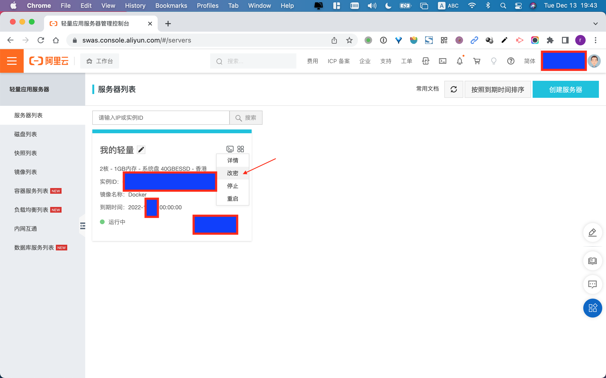

# Trojan 服务端安装和客户端使用教程

## 第 1 步 注册域名

注册域名 <https://wanwang.aliyun.com/domain/>


进入「域名列表」，实名认证。

> 提示：实名认证后一般需要等待 30 分钟审核时间，具体时间以提示信息为准！

<https://dc.console.aliyun.com/next/index#/domain-list/all>


## 第 2 步 购买「轻量应用服务器」

<https://common-buy.aliyun.com/?commodityCode=swas&regionId=cn-hongkong>


## 第 3 步 解析域名

进入「服务器列表」，复制「服务器 IP 地址」。

<https://swas.console.aliyun.com/#/servers>


进入「域名列表」，解析域名。

<https://dc.console.aliyun.com/next/index#/domain-list/all>


填写二级域名和 IP 地址


检测「解析域名」是否生效

<https://www.site24x7.com/find-ip-address-of-web-site.html>


## 第 4 步 设置服务器 root 用户密码

进入「服务器列表」

<https://swas.console.aliyun.com/#/servers>





## 第 5 步 连接服务器


## 第 6 步 安装 Trojan 服务端

> 提示：如果安装失败或遇到问题不知道如何处理，请跳到最后一步！

复制以下命令行，粘贴到控制台运行。

```bash
source <(curl -sL https://git.io/trojan-install)
```


## 第 7 步 进入 Trojan 管理后台

在浏览器打开链接 <https://你的域名>，注意：是 `https`！

设置管理员密码


登录管理后台


登录成功


点击用户管理

> 提示：如果想给其他人使用，可以在此页面添加用户！


点击分享


用手机客户端扫面二维码添加服务器


## 第 8 步 客户端连接

下载客户端

- 苹果手机：本人推荐使用付费 App「Shadowrocket」，
  - 需要苹果商店「中国区以外」的帐号（第一次使用可暂时跟我借）
  - 可共享给电脑使用
- 安卓手机：网上推荐使用 <https://github.com/trojan-gfw/igniter/releases>
- 苹果电脑：下载链接 <https://github.com/trojan-gfw/trojan/releases>
- 其他电脑：下载链接 <https://github.com/trojan-gfw/trojan/releases>

提示：电脑上的浏览器使用，请安装谷歌浏览器插件「SwitchyOmega」，不会的请先学习一下！

电脑上启动 Trojan 客户端，以苹果电脑为例：

用文本编辑器打开配置文件 `config.json`


在配置文件 `config.json`，填写你的「域名」和「密码」


在命令行终端启动


配置谷歌浏览器插件


提示：其他更牛逼的电脑客户端推荐「Clash」，可自行搜索了解，使用比较复杂，刚开始不建议使用！

## 第 9 步 服务端安装过程出错重置系统

服务器重置系统


